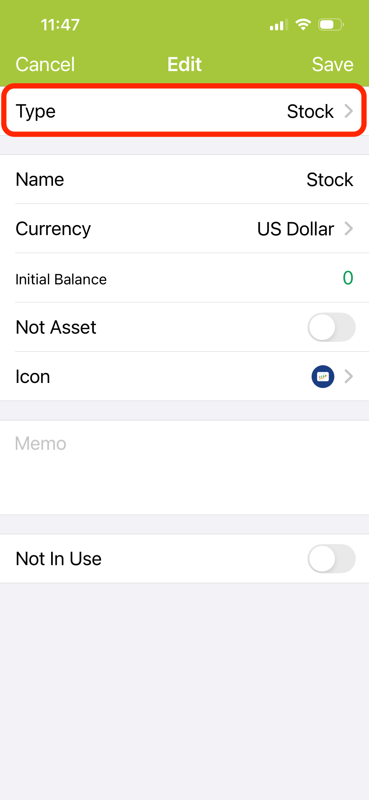

---
metaLinks:
  alternates:
    - >-
      https://app.gitbook.com/s/Hseb2PqmAac4uS7KJtxo/guides/icloud-yun-zhang-ben-she-ding
---

# Create a Stock Account

A stock account is a dedicated account for recording your stock investments.

1. Go to the **Accounts** page and tap **＋** in the top-right corner to create a new account. 
2. Select **Stock** as the account type. 
    
<figure><figcaption></figcaption></figure>

3. Enter an account name (e.g. US Stocks, Japan Stocks).
4.  Select the account currency.

    > **Tip:** The currency determines which market is available. For example, setting it to JPY (Japanese Yen) will automatically list the Japan stock market.
5. After saving, the account will appear in your account list. Tap it to enter Stock Asset Management.
