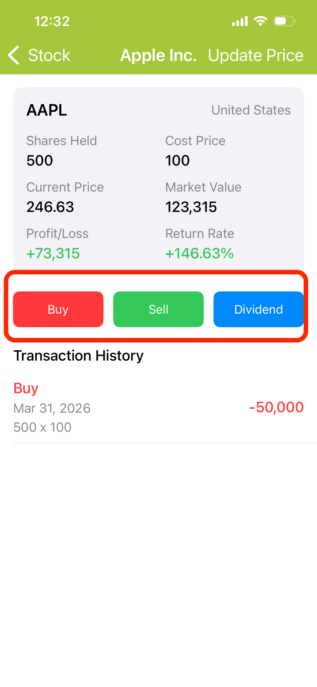

---
metaLinks:
  alternates:
    - https://app.gitbook.com/s/Hseb2PqmAac4uS7KJtxo/guides/shou-dong-tong-bu
---

# Record a Transaction (Buy / Sell / Dividend)

Tap a holding to open its detail page. Three buttons — **Buy**, **Sell**, and **Dividend** — are available in the center of the page to record each type of transaction.

> **Tip:** Purchase cost is calculated using the **weighted average method**. After each buy, the system automatically recalculates the average cost price (including fees).

<figure><figcaption></figcaption></figure>

 
